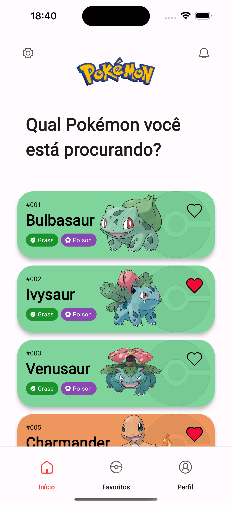
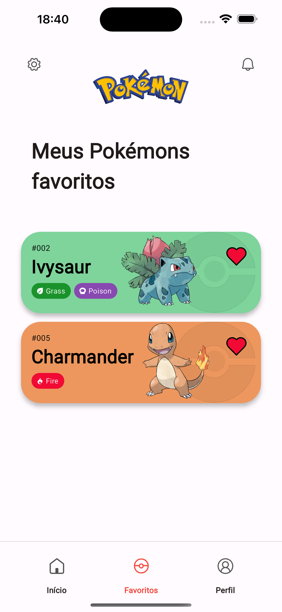
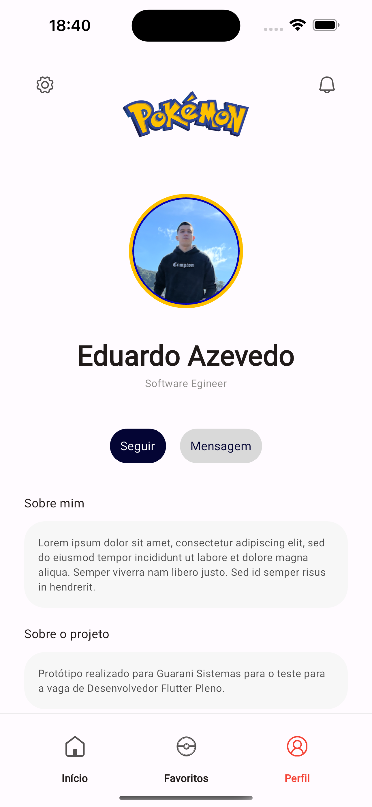
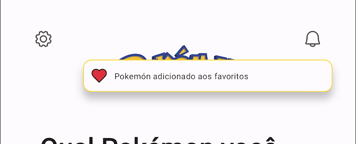
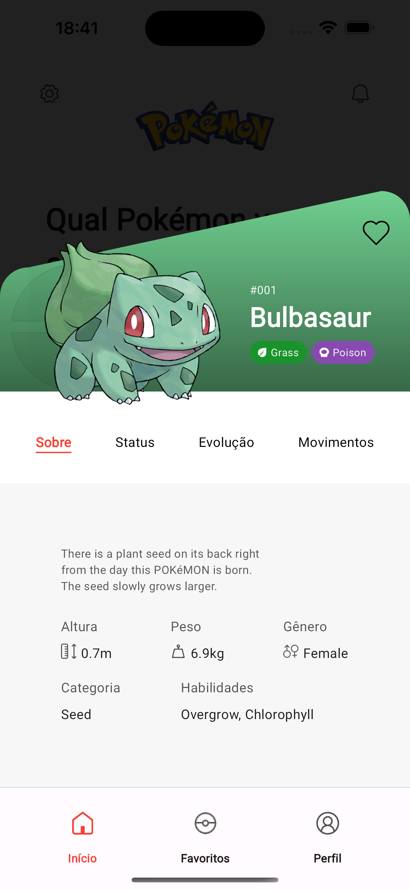
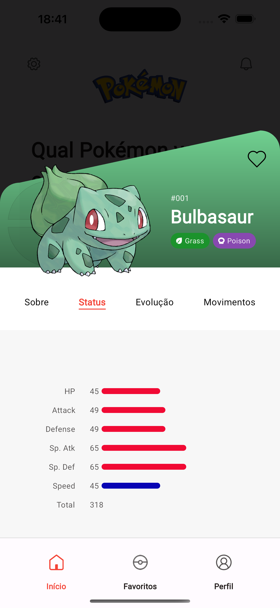
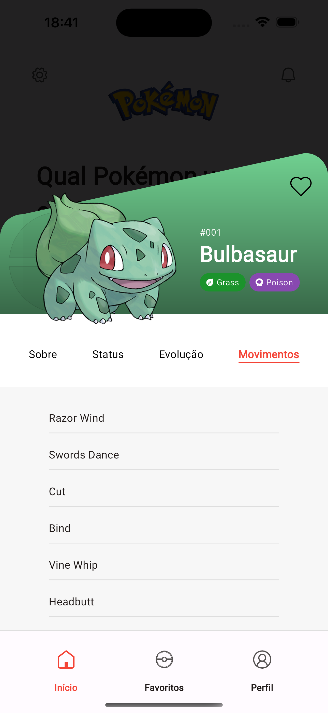

# Pokedex

Um app desenvolvido com flutter. Desafio proposto pela empresa Guarani Sistemas.

## Tecnologias Utilizadas

A aplicação foi desenvolvida utilizando flutter e adotando padrões de código limpo, seguindo a arquitetura Clean com Modular para o gerenciamento de rotas e GetX para gerenciamento de estado e injeção de dependencias, obtendo dados da API "pokeapi.com" utlizando a biblioteca http.

## Funcionalidades

    -   listagem de pokemons;
    -   Adicionar/remover favoritos;
    -   I18n (Internacionalização);
    -   Detalhes do pokemon (about, stats, moves).

## Capturas de Tela
### Home

	
    
    
    
    

### Notificações

    
    
    

### Detalhes

    
    
    
    
    

